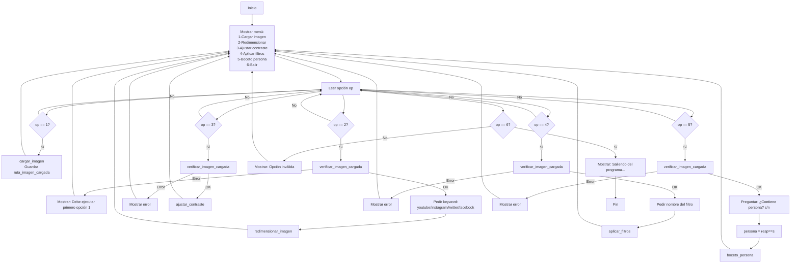

## PROYECTO 2

###GRUPO
###Almirón, Sebastián
###Fernández, Santino
###Infante, Sebastián

### PARTE 1

### Archivo de pruebas de fotoapp.py

## Diagrama de Flujo del Menú

## Parte 2

# Regresión Lineal Múltiple - Precios de Gas Natural

## Dataset
- **Fuente**: [datos.gob.ar](https://datos.gob.ar/dataset)
- **Archivo**: 'precios-de-gas-natural.csv'
- **Registros**: 1,458 filas
- **Variable objetivo (Y)**: 'precio_distribuidora'
- **Features (X)**: 'precio_gnc', 'precio_usina', 'precio_industria'

## Objetivo
El objetivo de este proyecto es entrenar un modelo de Regresión Lineal Múltiple para predecir el precio de distribución del gas natural ('precio_distribuidora') utilizando como variables predictoras el precio del GNC ('precio_gnc'), el precio de la usina ('precio_usina') y el precio de la industria ('precio_industria').

## Ejercicios realizados

1.  **Carga de Datos y Visualización de Variables**: Se cargó el dataset, se exploró su estructura ('.info()', '.head()', '.describe()') y se visualizaron las distribuciones de las variables clave mediante histogramas. También se analizó la correlación entre las variables numéricas con una matriz de correlación.
2.  **Cambio de Estructura de Datos a Matricial**: Las variables seleccionadas ('X' y 'Y') se transformaron a formato matricial (arrays de NumPy) para ser utilizadas por el modelo de scikit-learn.
3.  **Particionado de Datos en Entrenamiento y Test**: El dataset se dividió en conjuntos de entrenamiento (80%) y prueba (20%) para evaluar la capacidad de generalización del modelo.
4.  **Generación del Modelo con los Datos de Entrenamiento**: Se instanció y entrenó un modelo de 'LinearRegression' de scikit-learn utilizando el conjunto de entrenamiento.
5.  **Evaluación del Modelo con los Datos de Entrenamiento**: Se calcularon métricas como R², MSE, RMSE y MAE sobre el conjunto de entrenamiento para entender el ajuste del modelo a los datos vistos.
6.  **Evaluación del Modelo con los Datos de Test**: Se calcularon las mismas métricas sobre el conjunto de test para evaluar el desempeño del modelo con datos no vistos.

## Resultados obtenidos

### Métricas del Modelo
| Métrica | Entrenamiento | Test |
| :------ | :------------ | :--- |
| **R²** | 0.1729 | 0.1752 |
| **MSE** | 3.3791 | 2.6616 |
| **RMSE** | 1.8382 | 1.6315 |
| **MAE** | 1.2374 | 1.1159 |

### Coeficientes del Modelo
| Feature | Coeficiente |
| :------ | :---------- |
| **precio_gnc** | 0.5526 |
| **precio_usina** | 0.1218 |
| **precio_industria** | -0.0604 |
| **Intercepto** | 0.7862 |

## Conclusiones

### 1 ¿Cuál fue el desempeño del modelo?
El modelo de Regresión Lineal Múltiple obtuvo un **R² de 0.1752** en el conjunto de test. Esto significa que el modelo explica aproximadamente el **17.52%** de la varianza en el precio de distribución. Este valor de R² es **bajo**, lo que indica que el modelo actual tiene una capacidad limitada para predecir con precisión el 'precio_distribuidora' basándose únicamente en las tres features seleccionadas.

El **RMSE (Raíz del Error Cuadrático Medio) de 1.6315** en el conjunto de test sugiere que, en promedio, las predicciones del modelo se desvían aproximadamente 1.63 unidades del valor real del 'precio_distribuidora'.

### 2 ¿Qué variable fue la más influyente según los coeficientes del modelo?
Según los coeficientes del modelo, la variable más influyente es **'precio_gnc'** con un coeficiente de **0.5526**.

**Interpretación**: Por cada unidad que aumenta el 'precio_gnc', se espera que el 'precio_distribuidora' aumente en aproximadamente 0.55 unidades, asumiendo que las otras variables ('precio_usina' y 'precio_industria') se mantienen constantes.

La variable 'precio_industria' tiene un coeficiente negativo (-0.0604), lo que sugiere una relación inversa débil: un aumento en el 'precio_industria' se asocia con una ligera disminución en el 'precio_distribuidora'.

### 3 ¿Las features extraídas del dataset fueron buenas predictoras? ¿O sugieren otras?
Las features seleccionadas ('precio_gnc', 'precio_usina', 'precio_industria') mostraron una **capacidad predictiva limitada**, como lo evidencia el bajo R². La correlación de estas features con el 'precio_distribuidora' es moderada a baja:
- 'precio_gnc': 0.40 (la más alta)
- 'precio_usina': 0.19
- 'precio_industria': 0.13

### 4 Comparativa de resultados de evaluación del modelo con los datos de Entrenamiento y de Test.
| Métrica | Entrenamiento | Test | Diferencia (Train - Test) |
| :------ | :------------ | :--- | :------------------------ |
| **R²** | 0.1729 | 0.1752 | -0.0024 |
| **MSE** | 3.3791 | 2.6616 | 0.7175 |
| **RMSE** | 1.8382 | 1.6315 | 0.2068 |
| **MAE** | 1.2374 | 1.1159 | 0.1215 |

**Interpretación**:
Las métricas de desempeño (R², MSE, RMSE, MAE) son **muy similares** entre el conjunto de entrenamiento y el conjunto de test. Esto es una buena señal, ya que indica que el modelo **no presenta sobreajuste (overfitting)**; es decir, no ha memorizado los datos de entrenamiento y generaliza de manera consistente a datos no vistos.

Sin embargo, la similitud en los valores bajos de R² en ambos conjuntos sugiere que el modelo es **demasiado simple (underfitting)** para capturar la complejidad subyacente de los datos. El modelo es estable, pero su capacidad predictiva es limitada.

### Conclusión Final
El modelo de Regresión Lineal Múltiple desarrollado es **estable y generaliza bien** a datos nuevos, pero su **capacidad predictiva es baja** debido a la simplicidad de las features utilizadas.